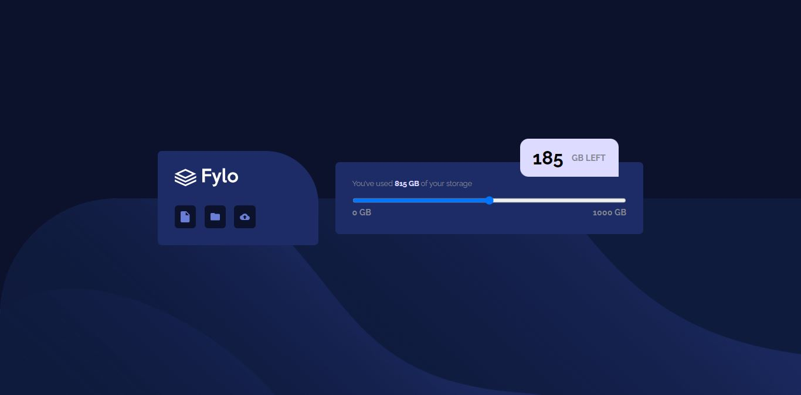

# Frontend Mentor - Fylo data storage component

Esta es una solución para [Design preview for the Fylo data storage component coding challenge](https://www.frontendmentor.io/challenges/fylo-data-storage-component-1dZPRbV5n). Los desafíos de Frontend Mentor te ayudan a mejorar tus habilidades de codificación mediante la creación de proyectos realistas.

## Tabla de contenidos

- [Visión general](#overview)
  - [El desafío](#the-challenge)
  - [Captura de pantalla](#screenshot)
  - [Enlaces](#links)
- [Mi proceso](#my-process)
  - [Construido con](#built-with)
  - [Lo que aprendí](#what-i-learned)
  - [Desarrollo continuo](#continued-development)
  - [Recursos útiles](#useful-resources)
- [Autor](#author)

## Visión general

### El desafío

- Ver el diseño óptimo del sitio según el tamaño de pantalla de su dispositivo.

### Captura de pantalla



### Enlaces

- URL de la solución: [GitHub](https://github.com/ReyCrisGit/)
- URL del sitio en vivo: [GitHub Pages](https://reycrisgit.github.io/fylo-data-storage-component-master/)

## Mi proceso

### Construido con

- Semantic HTML5 markup
- CSS custom properties
- Flexbox
- Mobile-first workflow

### Lo que aprendí

Mientras desarrollaba el proyecto, se me ocurrido utilizar el pseudo-elemento `::before` para los fondos y funcionó.
```css
body {
    background-image: none;
    background-color: var(--very-dark-blue);
        
}
body::before {
    content: "";
    display: block;
    width: 100%;
    height: 50vh;
    background-image: url('/images/bg-desktop.png');
    background-size: cover;
    position: absolute;
    bottom: 0;
    z-index: -1;
}
```
### Desarrollo continuo

Dominar FlexBox y CSS Grid. Luego poner en práctica JavaScript para los demás desafíos.

### Recursos útiles

Los videos de [Jordan Alexander](https://www.youtube.com/@AlexCGDesign). Me ayuda mucho con las buenas prácticas.

## Autor
Cristian Barrios
- [GitHub](https://github.com/ReyCrisGit)
- [FrontendMentor](https://www.frontendmentor.io/profile/ReyCrisGit)